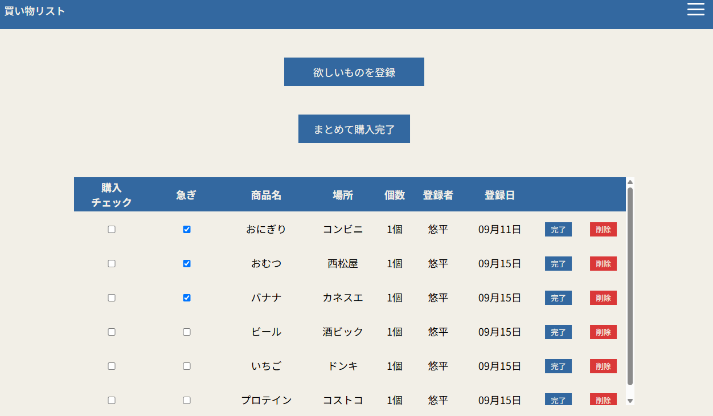

# 買い物リストアプリ

家族間でリアルタイム（または簡単に）買い物リストを共有・管理できるWebアプリケーションです。

## 💡 開発の背景・概要

4歳（保育園児）と0歳の子どもがいて、保育園で必要なものや乳児特有の必要なものがこまごまと日々
発生する中で、「買い忘れを防ぎたい」「誰が何を買うか家族で共有したい」という課題を解決するために開発しました。直感的なUIで、家族全員が簡単にリストの追加・更新を行えます。

## ✨ 主な機能

- **リストの作成・編集・削除**: 買いたいものを簡単に追加・整理できます。
- **リアルタイム共有/同期**: 家族がリストを更新すると即座に反映されます。
- **購入完了チェック**: 買い物が終わったアイテムをチェックして見え消し/完了状態にできます。
- **「もう一度買う」機能**: 一度購入した商品は購入履歴に登録され、「もう一度買う」ボタンから再度買い物リストに登録できます。毎週買うものなどの登録の手間を省くことができます。
- **レスポンシブ対応**: スマートフォン（iOS / Android）やPCから快適に利用可能です。

## 🛠 使用技術 (Tech Stack)

### フロントエンド

- HTML5 / CSS3 / JavaScript

### バックエンド / データベース

- PHP / Laravel
- PostgreSQL

### インフラ・デプロイ

- Render

## 🚀 デモURL

アプリを実際に触っていただけるURLはこちらです:  
👉 [https://https://shopping-list-demo.onrender.com/items]

※ テスト用アカウント:

- メールアドレス: `test@example.com`
- パスワード: `password123`
